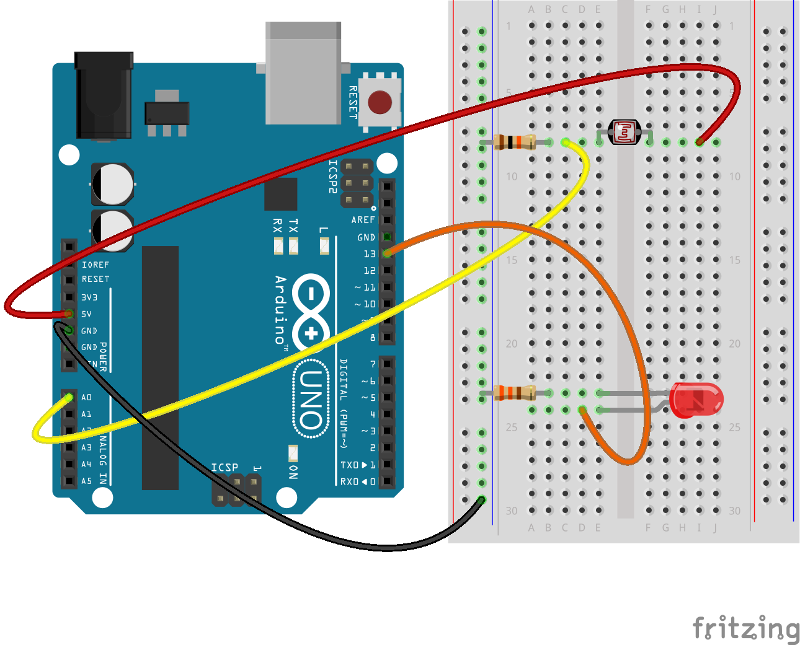

# ArduinoTutorial

### Arduino Hands-on Introduction Workshop

This workshop originally created by:
Michael Shiloh and Judy Castro for *Teach Me To Make*

Revised by Sudhu Tewari 2018-24

<!-- ##### Arduino Examples - coming soon! --> 

The workshop will focus on getting you up and running with Arduino quickly, so that you will understand the basic procedures for working with Arduino and can explore further on your own.

We will cover how to install Arduino on your laptop; how to understand, modify, and write Arduino programs; how to connect sensors to Arduino and read them from a program; and how to connect actuators (LEDs, motors, speakers) and control them from a program. Other topics will be covered as interest dictates and time permits.

#### What is Arduino anyway?
Read about Arduino here : https://www.arduino.cc/en/Guide/Introduction
Additionally: Lady Ada's [Learn Arduino](https://learn.adafruit.com/ladyadas-learn-arduino-lesson-number-0?view=all) lessons are great. The [tour](https://learn.adafruit.com/ladyadas-learn-arduino-lesson-number-0?view=all#take-a-tour) of Arduino architecture is particularly useful for understanding Arduino.

#### Before the Workshop - Install Arduino Software
Arduino software (IDE) runs on Windows, Mac OSX, and Linux. Please download the (free) Arduino software prior to the workshop from http://arduino.cc/en/Main/Software, and install as much as you can.  We prefer to use an older version of the Arduino IDE: Version 1.8.19. Feel free to download the newer version as well and run them both for comparison.
Please bring your laptop with the software installed to the workshop.

Additional instructions at http://arduino.cc/en/Guide/HomePage  
and https://learn.adafruit.com/ladyadas-learn-arduino-lesson-number-0/download-software

An Arduino kit will be provided for use during the workshop or you may bring your own.

If you have questions prior to or after the workshop please contact Sudhu: loopstick@hotmail.com

#### At the Workshop
 - Please interrupt any time with questions.

### First steps: Verifying correct installation
All of this is in the Arduino Getting Started guide for your operating system. [https://www.arduino.cc/en/Guide/HomePage](https://www.arduino.cc/en/Guide/HomePage).

1. Connect Arduino via USB cable
   - Windows? Might see “New Hardware Discovered” and later might see “New Hardware Ready for Use”.
   - Mac OS X? Might see “New Network Interface Found”. Click “Network Preferences…”,  click “Apply”, and when it finishes, click “Close”. It doesn’t matter if the configuration fails.
   - Linux? Nothing to do here

2. Open Arduino software (IDE)

3. Select _Tools -> Board_
   - You have an Uno.

4. Select _Tools -> Port_
   - Windows? Chose the largest COM number
     - No COMs? Raise your hand for help or visit [troubleshooting](http://arduino.cc/en/Guide/Troubleshooting)
   - Mac OS X? Chose either usbmodem - you should also see _(Arduino Uno)_
     - No usbmodem? Raise your hand for help or visit [troubleshooting](http://arduino.cc/en/Guide/Troubleshooting)
   - Linux? There is only one choice

5. Open _File->Examples->Basics->Blink_
   - Click “Upload”
   - Look for errors in the bottom window of the program
     - Errors? Raise your hand for help or visit [troubleshooting](http://arduino.cc/en/Guide/Troubleshooting)
   - Look for the amber LED on your Arduino to be blinking
     - No blinking? Raise your hand for help or visit [troubleshooting](http://arduino.cc/en/Guide/Troubleshooting)

*******************************************************************************
### Is this thing on?
Copy the code below and paste it into a new Arduino sketch _OR_ download and open this example sketch: [HelloWorld.ino](/examples/HelloWorld/HelloWorld.ino)

```cpp
/*
  Hello World
  A "Hello, World!" program generally is a computer program that
	outputs or displays the message "Hello, World!".
	Such a program is very simple in most programming languages,
	and is often used to illustrate the basic syntax of a programming language.
	It is often the first program written by people learning to code
*/

void setup() {
//initialize serial communications at 9600 baud rate
Serial.begin(9600);
}

void loop(){
//send 'Hello, world!' over the serial port
Serial.println("Hello, world!");
//wait 100 milliseconds so we don't drive ourselves crazy
delay(1000);
}
```
The _Serial_ commands allow Arduino to send a message to your laptop. In order to see this message you need to open the _Serial Monitor_ by clicking on the magnifying glass near the top right corner.
- If you are using Arduino IDE 1.8._ the serial monitor will open in another window.
- If you are using Arduino IDE 2._._ the serial monitor will display at the bottom of the IDE window.

a little code anatomy:
- The [setup()](https://www.arduino.cc/reference/en/language/structure/sketch/setup/) function is called when a sketch starts.
  - Use it to initialize variables, pin modes, start using libraries, etc.
  - The setup() function will only run once, after each power-up or reset of the Arduino board.
- The [loop()](https://www.arduino.cc/reference/en/language/structure/sketch/loop/) the loop() function does precisely what its name suggests, and _loops_ consecutively through your list of instructions to control the Arduino.
  - The loop() functions runs continuously as long as the Arduino is powered on.
  - Each instruction is executed in order from top to bottom.
  - Arduino only executes one instruction at a time.

More on the specific functions and variables soon! Let's make something happen in the real world first.

*******************************************************************************
### How to use Arduino to turn something ON and OFF

Copy or download the code below rather than the Arduino tutorial code included in File > Examples. 
(The new version of Blink uses a helpful pointer to BUILTIN_LED, which makes part of the following explanation more difficult)
Most microcontrollers have an on-board LED which you can use for a real-world feedback. 
- On the Arduino Uno the built-in LED is connected to pin 13.
- We can send a signal to pin 13 to turn the LED on and off.
How does the program (sketch) do this? 
- it's all in the example below
  
Copy the code below and paste it into a new Arduino sketch _OR_ download and open this example sketch: Blink example sketch: [01a_Blink_st.ino](examples/01_Blink_st/01a_Blink_st/01a_Blink_st.ino)

```cpp
/*
  Blink

  Turns an LED on for one second, then off for one second, repeatedly.

  Most Arduinos have an on-board LED you can control. 
  On the UNO it is attached to digital pin 13

  This example code is modified from.
  https://www.arduino.cc/en/Tutorial/BuiltInExamples/Blink
*/

int led = 13;  // define a variable to hold the pin number of the internal LED

// the setup function runs once when you press reset or power the board
void setup() {
  // initialize digital pin LED_BUILTIN as an output.
  pinMode(led, OUTPUT);
}

// the loop function runs over and over again forever
void loop() {
  digitalWrite(led, HIGH);   // turn the LED on (HIGH is the voltage level)
  delay(1000);                       // wait for a second
  digitalWrite(led, LOW);    // turn the LED off by making the voltage LOW
  delay(1000);                       // wait for a second
}
```
upload this code to your Arduino!

What happens?

You should see a little LED on the Arduino begin to blink on and off, about once per second.

Can you identify the code that makes this happen?

everything is explained in the [Blink](http://arduino.cc/en/Tutorial/Blink) tutorial
- some more code anatomy - more info about an Arduino [sketches](https://docs.arduino.cc/learn/programming/sketches/)

#### Exercise:
combine HelloWorld and Blink to make a program that shows it's working with physical (LED) and digital (serial ) output.
- _Hint/Cheat:_ [HelloWorld_blink.ino](examples/02_HelloWorld_blink/02_HelloWorld_blink.ino)
- 
*******************************************************************************
### Let's add an LED of our own
- Add an external LED (as opposed to the internal LED we just lit up)

  

  Where (and how) do we connect the LED?

 <!--  -->

 <!--  -->
  
  <!-- -->

  
  

### Using a solderless Breadboard to connect Arduino to other things (LEDs, motors, speakers, sensors, etc.)

The Solderless Breadboard (SparkFun [tutorial:](https://learn.sparkfun.com/tutorials/how-to-use-a-breadboard))


[Breadboard connections](http://wiring.org.co/learning/tutorials/breadboard/)


Use the breadboard to add an external LED.
- LEDs must always be used with resistors so they don’t burn out.
  - The resistor value can be anywhere from 100 ohm to 1k ohm.
    - The lower the resistance, the brighter the light.
    - Evil Mad Scientist explains it well [here](https://www.evilmadscientist.com/2012/resistors-for-leds/)
  - Resistor Color Code!
    - [Learn the Resistor Color Code in in 5 minutes](http://www.resistorguide.com/resistor-color-code/)

    

- LEDs are polarized
  - video: [identifying LED polarity](https://www.youtube.com/watch?v=SRDgNR_yCms)

    

Here’s a picture showing how to connect the LED and resistor on the breadboard:

 <!--  -->


Here is another view of this circuit:

<!--  -->


And here is a schematic of this circuit:

<!--  -->


Use the Blink sketch we used earlier: [01a_Blink_st.ino](examples/01_Blink_st/01a_Blink_st/01a_Blink_st.ino)
- (you can also use the IDE example, but it has some "hepful" shortcuts that make what we'll do next more complicated: _File -> Examples -> Basics -> Blink_)
	
 - Does your LED blink?
		(think about why)

#### Exercise 1:
Move LED to a different pin (e.g. pin 8).
	See if you can figure out how to do this on your own

_Hint:_ the LED won’t blink until you change the program, since the program is only turning pin 13 on and off. Change the program to control pin 8.

#### Exercise 2:
If you changed the program to control only pin 8, then the built-in LED on pin 13 is no longer blinking. Can you change the program to make them both blink?

Are we limited to LEDs? No; we could replace the LED (and its resistor) with any other suitable device, with some considerations. We’ll learn more about this later.

*******************************************************************************
### How to use a sensor: analogRead()
So far we’ve only used Arduino as an output device, to control something in the physical world (the LED). The other way of interfacing to the physical world is as an input device, using a sensor to get information about the physical world. We’ll start with a photoresistor, also called a light dependent resistor or LDR. It’s a resistor whose resistance depends on the light: the more light, the lower the resistance. (The resistor we used above with the LED is a fixed resistor.)


<!--  -->

The LDR responds to the amount of light by changing its resistance. Arduino cannot measure resistance directly, but can measure voltage (electrical potential).  Fortunately, we can easily convert a varying resistance to a varying voltage using a fixed resistor to create a [voltage divider](https://learn.sparkfun.com/tutorials/voltage-dividers/all). This time the fixed resistor needs a larger resistance, so select a 10k ohm resistor and build the circuit below. You don’t need to remove the LED circuit as there should be room on your breadboard for both, and we’ll use the LED again later.

<!--  -->


Open and upload this sketch:
[03_LDR_LightSensor.ino](/examples/03_LDR_LightSensor/03_LDR_LightSensor.ino)
- you can also use the Arduino IDE example ->_File->Examples->Basics->AnalogReadSerial_

How do you know if anything is working? Arduino might be reading the sensor, but is it telling you anything? 

Arduino is connected to your computer, so they can communicate - just like we did earlier with Hello World, but now your Ardunio is sending sensor DATA!
 - this line: ```Serial.println(sensorValue);``` allows Arduino to send a message to your laptop. 
- In order to see this message you need to open the _Serial Monitor_ by clicking on the magnifying glass near the top right corner.
- you can also see a graph of the real time data with the Serial Plotter (_Tools > Serial Plotter_)
- Read the Arduino [AnalogReadSerial tutorial](http://arduino.cc/en/Tutorial/AnalogReadSerial) to find out more.
- Also see _File->Examples->Communication_ for more examples of other types of Serial communication).

Now that we've got sensor data coming in (as a range of values) what can we do with the data?

We could do some math to calculate the voltage we're measuring:
 -> _File->Examples->Basics->AnalogReadVoltage_
 - this will show us the voltage that the Arduino analog pin is measuring

What other kinds of sensors are there?
- [Sensor workshop at ITP](https://itp.nyu.edu/physcomp/lessons/sensors-the-basics/)
- [Adafruit Sensors](https://www.adafruit.com/category/35)
- lots of different sensors means we can sense lots of different things!

That's nice, but what if we want to use the sensor data to control some kind of physical reaction (light, heat, motion) to the data?

Let's shift our focus, for a moment, to outputting a range of voltages. Then we'll put the input and output together to get real world input to control real world output. 

*******************************************************************************
### analogWrite(): Controlling speed or brightness
If digitalWrite() can turn an LED on and off, and analogRead() can read a range of values, what would you guess analogWrite() might do?
- If digitalWrite() can turn an LED on and off, and analogRead() can read a range of values, what would you guess _analogWrite()_ might do?
  - You guessed it!
- analogWrite() outputs a range of values, using [PWM](https://www.arduino.cc/en/tutorial/PWM)
  - PWM = pulse width modulation
  - this allows us, effectively, to output any voltage between minimum and maximun
    - minimum = 0 volts = 0 in code
    - maximum = 5 volts = 255 (@8bit resolution)

Move the LED to pin 9:


Now upload this sketch:
[04_LED_Fade.ino](/examples/04_LED_Fade/04_LED_Fade.ino) 
 - you can also use the Arduino IDE _Fade_ example:_File -> Examples -> Basics -> Fade_


What’s the LED doing? Can you figure out how the sketch is doing this?
```cpp
analogWrite(led, brightness);
// and then
brightness = brightness + fadeAmount;
// How does it know to start fading down when it reaches the maximum value?
  if (brightness == 0 || brightness == 255) {
    fadeAmount = -fadeAmount ;
  }
```

Why did I ask you to move the LED to pin 9?
	It turns out analogWrite() only works on certain pins which are capable of [PWM](https://www.arduino.cc/en/tutorial/PWM) output: 3, 5, 6, 9, 10, and 11.
	see the [Arduino Uno Board Pins reference](https://www.arduino.cc/en/Reference/Board) for more info

for extra fun, check out _File -> Examples -> Analog -> Fading_ <- this implements a For loop to do the fading!

*******************************************************************************
### Interfacing input & output -> sensor data controls LED state
Now that we've worked with _analogRead()_ to read a range of voltage coming from our LDR.
AND
we've used _analogWrite()_ to fade our LED using a range of voltage

-> can we use the LDR data to control the LED brightness?
-> Yes, we can!!



#### Exercise: 
- use the LDR data to control the LED brightness!
- _Hint/Cheats:_
  - [06a_LDR_LED_ifConditional.ino](examples/06a_LDR_LED_ifConditional/06a_LDR_LED_ifConditional.ino)
  - [06b_LDR_LED_MapFade.ino](examples/06b_LDR_LED_MapFade/06b_LDR_LED_MapFade.ino)


*******************************************************************************
### RGB LED - 3 in 1 gets us (almost) all the colors we can imagine!
- RGB LEDs have 3 LEDs in one physical package
- RGB LEDs are really handy for non-text, non-serial debug and they make really pretty colors!
- We can use analogWrite() to define the intensity of each color with a value between 0 and 255. 
  - That means there are 256 x 256 x 256 = 16777216 possible colors!
 
<!--  -->

<!--  --> 

- we still need to use a limiting resistor to keep our LEDs safe
- Generally we use a slightly larger resistor (470 ohm) for the RED component and the same slightly smaller resistor values (430 ohm) for the GREEN and BLUE components.
  - for our circuit let's use:
    - 470 ohm for RED
      - color bands-> yellow, purple, black, black, brown
    - 430 ohm for GREEN and BLUE
      - color bands-> yellow, orange, black, black, brown
- We're using common _CATHODE_ RGB LEDs
  - the negative leg (the cathode) is shared by (is common to) all 3 LEDs

RGB LED wiring diagram 


RGB LED test code
- [06a_RGB_Test.ino](/examples/06_RGB_LED/06a_RGB_Test/06a_RGB_Test.ino)
- [06b_RGB_SimpleFade.ino](/examples/06_RGB_LED/06b_RGB_SimpleFade/06b_RGB_SimpleFade.ino)


Some other online information about RGB LEDs
 - https://randomnerdtutorials.com/electronics-basics-how-do-rgb-leds-work/
 - https://learn.adafruit.com/adafruit-arduino-lesson-3-rgb-leds/breadboard-layout
 - https://howtomechatronics.com/tutorials/arduino/how-to-use-a-rgb-led-with-arduino/


*******************************************************************************
### Button - Let's add some tactile input!!

start by wiring a button like this:


if you don't still have an LED hooked up, add one on pin 13, like this:


Button example code
- [07a_Button.ino](/examples/07_Button/07a_Button/07a_Button.ino) - same as _Examples -> Digital -> Button_
- [07b_Button_StateChangeDetection.ino](/examples/07_Button/07b_Button_StateChangeDetection/07b_Button_StateChangeDetection.ino) - same as _Examples -> Digital -> StateChangeDetection_


Some other online information about buttons (aka pushbuttons aka tactile swiches)
- [Tactile switches](https://www.youtube.com/watch?v=tYemeoqxpNk)
- [Understanding Pushbuttons and Pull Up and Pull Down Resistors](https://www.youtube.com/watch?v=AgQW81zzR18)
- [Using a Pushbutton as a Toggle Switch](https://www.youtube.com/watch?v=aMato4olzi8&ab_channel=PaulMcWhorter)


*******************************************************************************
### Potentiometer


- code, etc coming soon!


*******************************************************************************
### Servo motors
Servo motors are a simple and easy way to add motion to your Arduibno project.
- They 'know' their own position which makes them easy ton control
- they are not _that_ powerful (although larger, more power servos _do_ exist)

  

  


More comprehensive information about servos:
- [How To Mechatronics: How to Control Servo Motors with Arduino – Complete Guide](https://howtomechatronics.com/how-it-works/how-servo-motors-work-how-to-control-servos-using-arduino/)
- [Hobby Servo Tutorial: Sparkfun](https://learn.sparkfun.com/tutorials/hobby-servo-tutorial/all)


*******************************************************************************
### Sensor ranges, calibration, and mapping
Earlier, we lit up an LED using _analogWrite()_ based on sensor data _analogRead()_!

What else can _analogWrite()_ do?
	_analogWrite()_ also works well to control the speed of a motor. However now we need to consider whether our motor is compatible with Arduino’s outputs.

*******************************************************************************
### Arduino outputs: Voltage and current
- When used as outputs, two things must be considered: the voltage and the current. Our Arduino can deliver 5 v, and at most 40 mA.
- The voltage is determined by Arduino, but the current is determined by whatever we’re trying to control. In the case of the LEDs, they only need 20 mA or less. The motor we have might take more than 40 mA. In the worst case, when it’s stalled, it might want a 200 mA.
- The important thing to realize is that Arduino does not have the ability to limit this current. It will try to deliver whatever is asked of it, even if it overheats and damages itself.
- If we want to control a device that might take more than 40 mA, we have to use an intermediary.
- the most common device for controlling large current loads with a microcontroller is a transistor (we could also use a relay or a switch)

### Controlling large loads with a transistor
The transistor is like a bicycle gear: you control it with a small amount of current, and it in turn can control a lot more current. The transistor also allows us to use a higher voltage than the 5V Arduino can deliver.

Use a transistor to control a higher current for a motor.
 - There are hundreds of transisors that will work for this application. 
   - here are a few that I commonly use:
	- [TIP120](https://cdn-shop.adafruit.com/datasheets/TIP120.pdf) - Darlington sold by Adafruit
	- [IRF520](https://www.vishay.com/docs/91017/91017.pdf)
	- [IRF8721](https://cdn-shop.adafruit.com/datasheets/irlb8721pbf.pdf) - MOSFET sold by Adafruit
  - never assume the pinout of a transistor or IC.
    - ALWAYS look up the pinout before applying power.
      - or else 爆炸
      
Transistor Motor Control with 2x AA Batteries = 3V:


You can test this with either
	_File -> Examples -> Basics -> Blink_	
or
	_File -> Examples -> Basics -> Fade_

It's important to note that we are now using a separate power source for the motor. There are good reasons for doing so...

<!-- Transistor Motor Control with a 9v Battery:  --> 
	
##### References:
- [Arduino Transistor Motor Control](https://www.arduino.cc/en/Tutorial/TransistorMotorControl)
- [Using a Transistor to Control High Current Loads](http://itp.nyu.edu/physcomp/labs/motors-and-transistors/using-a-transistor-to-control-high-current-loads-with-an-arduino/)


#### More to explore
- Joining inputs and outputs: switch controls speed, switch choses between two brightness levels, thermistor or other sensor changes behavior, etc
- INPUT_PULLUP
- Interrupts
- Boolean logic, tests, and conditionals
- Making sounds: [Melody](https://itp.nyu.edu/physcomp/labs/labs-arduino-digital-and-analog/tone-output-using-an-arduino/) tutorial
- Multiple output devices: play melody while controlling motor speed, etc.
- The problem with, and a solution to, delay(): 
  - [BlinkWithoutDelay](http://arduino.cc/en/Tutorial/BlinkWithoutDelay) tutorial


#### Resources!!!
- [Dr Sudhu's resources page](https://github.com/loopstick/ResourcesForClasses)


